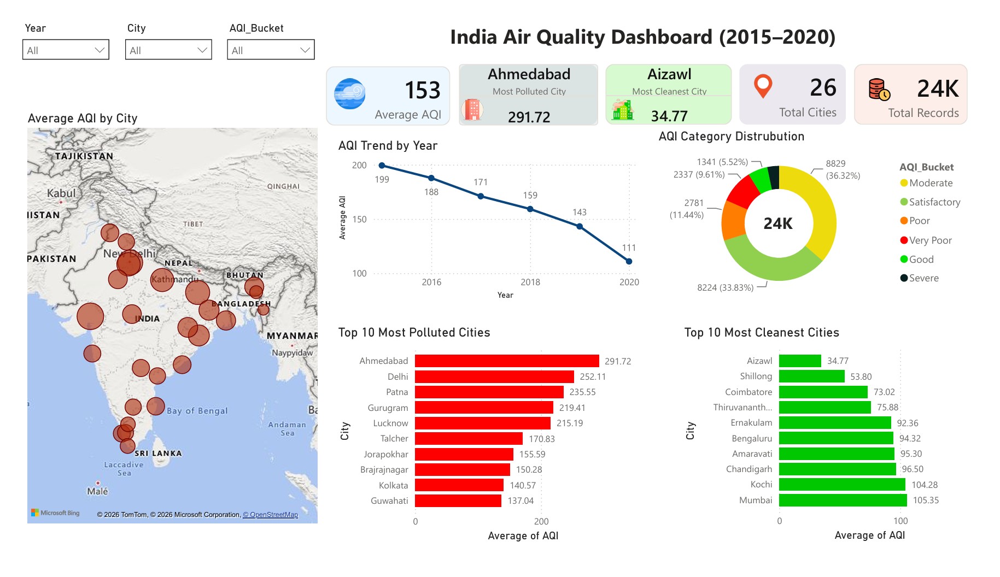
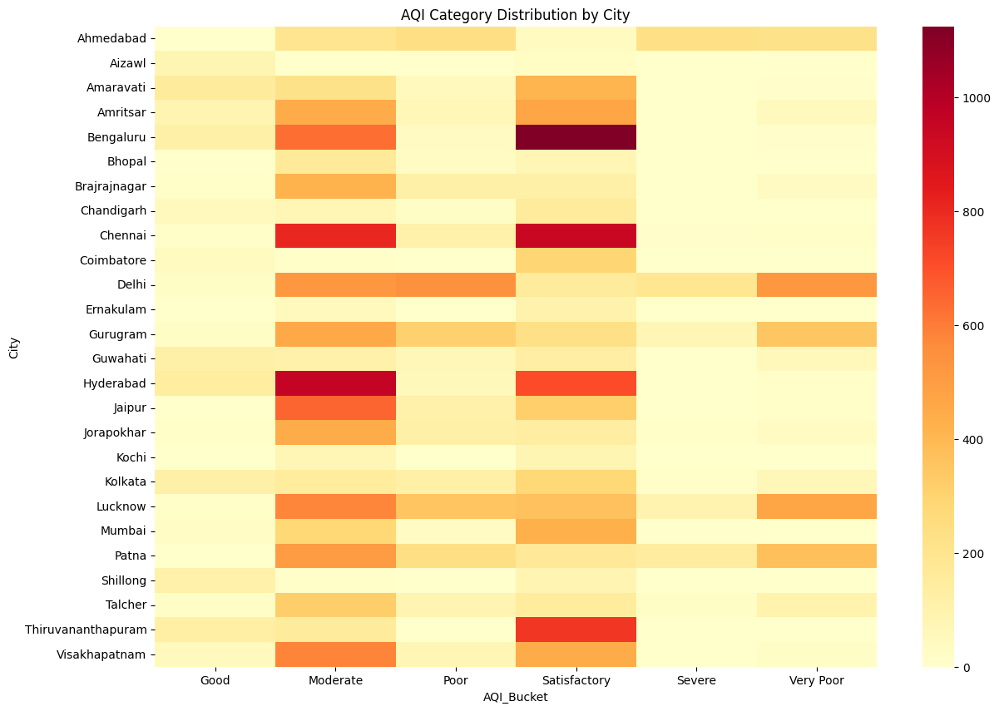
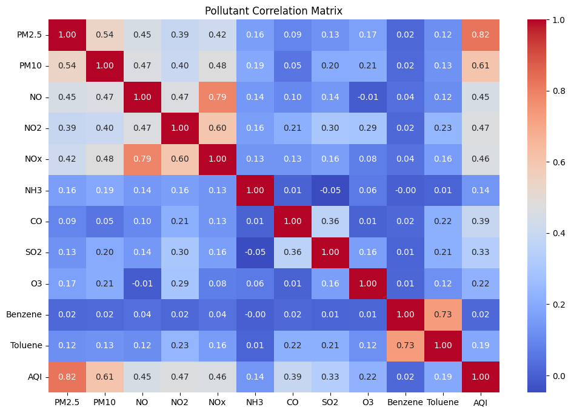
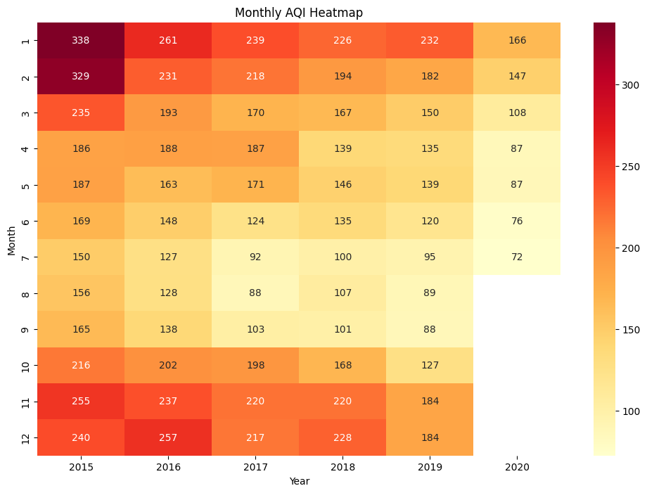
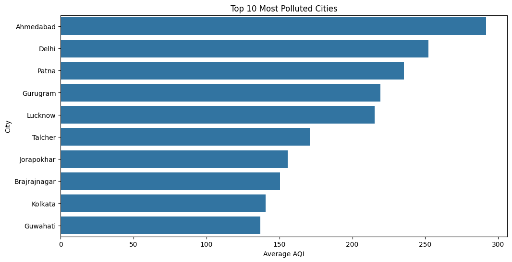
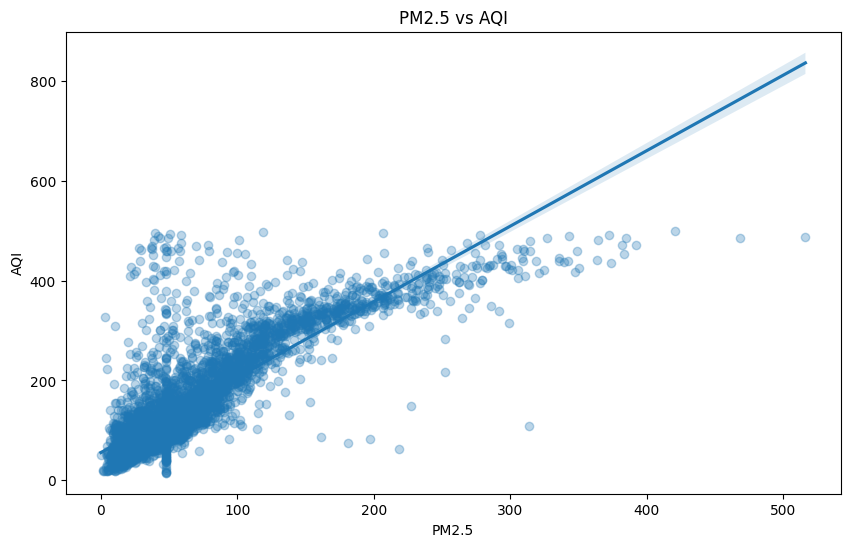

# India Air Quality Analysis: AQI Trends, City Intelligence & Pollutant Drivers

## 🛠️ Tech Stack

### Languages & Analysis

 

### Libraries

   

### BI & Database

  

### Development Tools

   


## Project Overview

Air pollution is one of India's most critical environmental and public health challenges. This project analyzes Air Quality Index (AQI) data collected across Indian cities to identify pollution trends, seasonal variations, regional differences, and key pollutant drivers affecting air quality.

The project follows a structured end-to-end analytics workflow beginning with raw CPCB data and progressing through preprocessing, exploratory analysis, SQL analytics, and interactive dashboard development.

### Project Objectives

* Analyze AQI trends across Indian cities.
* Identify the most and least polluted cities.
* Understand seasonal pollution patterns.
* Measure the impact of COVID-19 restrictions on AQI.
* Determine key pollutants driving air quality deterioration.
* Build an end-to-end analytics solution using Python, SQL, and Power BI.



---

## Analysis Highlights

### AQI Distribution Analysis

Understanding the overall distribution of AQI values across Indian cities.



---

### Correlation Matrix

Correlation analysis highlighting relationships between AQI and major air pollutants.



---

### Seasonal AQI Heatmap

Visualizing seasonal and annual pollution patterns.



---

### Most Polluted Cities

Ranking Indian cities based on average AQI.



---

### AQI vs PM2.5 Relationship

Analyzing the relationship between particulate matter concentration and AQI.



---

## Data Pipeline

```text
Raw CPCB Dataset (city_day.csv)
            │
            ▼
Data Cleaning & Preprocessing
            │
            ▼
      cleaned_aqi.csv
            │
    ┌───────┼────────┬────────┐
    ▼       ▼        ▼        ▼
  EDA      SQL    Power BI  Insights
            │        │
            └────┬───┘
                 ▼
        Interactive Dashboard
```
---

## Repository Structure

`## Repository Structure

```text
.
├── images
│   ├── dashboard.png
│   ├── aqi_distribution.png
│   ├── month_year_heatmap.png
│   ├── pollutant_correlation_matrix.png
│   ├── top_polluted_cities.png
│   ├── aqi_pm25_scatter.png
│   │
│   └── sql
│       ├── yearly_aqi_output.png
│       └── yearly_hotspot_output.png
│
├── notebooks
│   ├── 00_Data_Preprocessing.ipynb
│   ├── 01_Data_Quality_and_Understanding.ipynb
│   ├── 02_Temporal_and_Seasonal_Analysis.ipynb
│   ├── 03_City_Intelligence.ipynb
│   ├── 04_Pollutant_Driver_Analysis.ipynb
│   └── 05_sql_setup.ipynb
│  
│
├── city_day.csv
├── cleaned_aqi.csv
│
├── India_aqi_dashboard.pbix
│
├── sql_analysis.md
│
└── README.md
```

---

## Analysis Notebooks

### Data Preprocessing

Purpose:

* AQI validation
* Missing value treatment
* Feature engineering
* Dataset preparation

Notebook:
[00_Data_Preprocessing.ipynb](./notebooks/00_Data_Preprocessing.ipynb)

---

### Data Quality & Understanding

Purpose:

* Dataset exploration
* Data quality assessment
* AQI distribution analysis
* Feature understanding

Notebook:
[01_Data_Quality_and_Understanding.ipynb](./notebooks/01_Data_Quality_and_Understanding.ipynb)

---

### Temporal & Seasonal Analysis

Purpose:

* Annual AQI trends
* Monthly AQI patterns
* Seasonal pollution analysis
* COVID-19 impact assessment

Notebook:
[02_Temporal_and_Seasonal_Analysis.ipynb](./notebooks/02_Temporal_and_Seasonal_Analysis.ipynb)

---

### City Intelligence Analysis

Purpose:

* Most polluted cities
* Cleanest cities
* AQI category distribution
* City-level performance comparison

Notebook:
[03_City_Intelligence.ipynb](./notebooks/03_City_Intelligence.ipynb)

---

### Pollutant Driver Analysis

Purpose:

* Correlation analysis
* AQI vs PM2.5
* AQI vs PM10
* Pollutant importance ranking

Notebook:
[04_Pollutant_Driver_Analysis.ipynb](./notebooks/04_Pollutant_Driver_Analysis.ipynb)

---

## Key Insights

* Average AQI decreased by approximately 44% between 2015 and 2020.
* Winter emerged as the most polluted season across Indian cities.
* July recorded the lowest average AQI levels.
* AQI during the COVID-19 period was significantly lower than the pre-COVID average.
* Ahmedabad ranked among the most polluted cities.
* Aizawl consistently recorded some of the lowest AQI levels.
* PM2.5 demonstrated the strongest relationship with AQI.
* Strong seasonal patterns indicate recurring winter pollution spikes.

---

## SQL Analysis

The SQL component validates and extends Python-based findings through analytical queries and window functions.

Topics Covered:

* Dataset Overview
* City Ranking Analysis
* AQI Trend Analysis
* Seasonal Pollution Analysis
* AQI Category Distribution
* Pollutant Statistics
* Rolling Average Analysis
* LAG() and Window Function Analysis

SQL Documentation:

[SQL Analysis Documentation](./sql)

---

## Power BI Dashboard

The Power BI dashboard was developed to transform analytical findings into an interactive business intelligence solution.

Dashboard Pages:

### Executive Overview

* AQI KPIs
* Trend Analysis
* Category Distribution

### City Intelligence

* Polluted vs Clean Cities
* AQI Rankings
* City Comparison

### Pollutant & Seasonal Analysis

* AQI Heatmap
* Pollutant Relationships
* Correlation Analysis

Dashboard File:

[India_AQI_Dashboard.pbix](./powerbi/India_aqi_dashboard.pbix)

---

## Key Findings

* Average AQI decreased by approximately 44% between 2015 and 2020.
* AQI during the COVID-19 period was approximately 32% lower than the pre-COVID average.
* Winter emerged as the most polluted season.
* July recorded the lowest average AQI levels.
* Ahmedabad consistently ranked among the most polluted cities.
* Aizawl recorded the cleanest air quality.
* PM2.5 demonstrated the strongest relationship with AQI.
* Strong seasonal pollution spikes were observed during winter months.

---

## Skills Demonstrated

### Data Analytics

* Exploratory Data Analysis (EDA)
* Statistical Analysis
* Correlation Analysis
* Feature Engineering
* Data Cleaning & Validation

### Python

* Pandas
* NumPy
* Matplotlib
* Seaborn

### SQL

* Aggregations
* CTEs
* Window Functions
* Ranking Functions
* Time-Series Analysis

### Power BI

* DAX Measures
* Interactive Dashboards
* KPI Cards
* Heatmaps
* Drill-Down Analysis

---

## Repository Links

### Notebooks

* [Data Preprocessing](/notebooks/00_Data_Preprocessing.ipynb)
* [Data Quality & Understanding](/notebooks/01_Data_Quality_and_Understanding.ipynb)
* [Temporal & Seasonal Analysis](/notebooks/02_Temporal_and_Seasonal_Analysis.ipynb)
* [City Intelligence Analysis](/notebooks/03_City_Intelligence.ipynb)
* [Pollutant Driver Analysis](/notebooks/04_Pollutant_Driver_Analysis.ipynb)

### SQL

* [SQL Documentation](/sql_analysis.md)

### Dashboard

* [Power BI Dashboard](/India_aqi_dashboard.pbix)

---

## Author

**Abhishek Sharma**

Production & Industrial Engineering | 
Delhi Technological University (DTU)

