# SQL Analysis – India Air Quality Analysis

This folder contains SQL queries used to analyze India's Air Quality Index (AQI) dataset after preprocessing and cleaning.

**Database:** MySQL
**Dataset:** cleaned_aqi.csv
**Table:** air_quality

---

# Analysis Workflow

```text
Dataset Overview
      ↓
City Intelligence
      ↓
Temporal Analysis
      ↓
AQI Category Analysis
      ↓
Pollutant Analysis
      ↓
Advanced Window Function Analysis
```

---

# 1. Dataset Overview

## Total Records

### Query

```sql
SELECT COUNT(*) AS total_records
FROM air_quality;
```

### Output


---

## Total Cities

### Query

```sql
SELECT COUNT(DISTINCT City) AS total_cities
FROM air_quality;
```

### Output

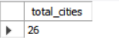

---

## Year Range

### Query

```sql
SELECT
    MIN(Year) AS start_year,
    MAX(Year) AS end_year
FROM air_quality;
```

### Output


---

# 2. City Intelligence Analysis

## Top 10 Most Polluted Cities

### Query

```sql
SELECT
    City,
    ROUND(AVG(AQI),2) AS avg_aqi
FROM air_quality
GROUP BY City
ORDER BY avg_aqi DESC
LIMIT 10;
```

### Output

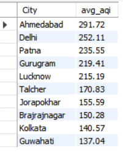

### Insight

Ahmedabad consistently ranked among the most polluted cities.

---

## Top 10 Cleanest Cities

### Query

```sql
SELECT
    City,
    ROUND(AVG(AQI),2) AS avg_aqi
FROM air_quality
GROUP BY City
ORDER BY avg_aqi ASC
LIMIT 10;
```

### Output

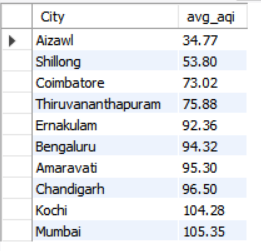

### Insight

Aizawl recorded the lowest average AQI.

---

## City Pollution Ranking

### Query

```sql
SELECT
    City,
    ROUND(AVG(AQI),2) AS avg_aqi,
    RANK() OVER(
        ORDER BY AVG(AQI) DESC
    ) AS pollution_rank
FROM air_quality
GROUP BY City;
```

### Output

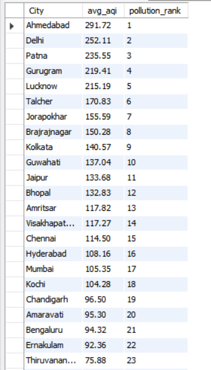

---

# 3. Temporal Analysis

## AQI Trend by Year

### Query

```sql
SELECT
    Year,
    ROUND(AVG(AQI),2) AS avg_aqi
FROM air_quality
GROUP BY Year
ORDER BY Year;
```

### Output

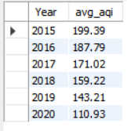

### Insight

Average AQI decreased significantly between 2015 and 2020.

---

## Worst Pollution Year

### Query

```sql
SELECT
    Year,
    ROUND(AVG(AQI),2) AS avg_aqi
FROM air_quality
GROUP BY Year
ORDER BY avg_aqi DESC
LIMIT 1;
```

### Output

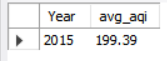

### Insight

2015 recorded the highest average AQI.

---

## Monthly AQI Analysis

### Query

```sql
SELECT
    Month,
    ROUND(AVG(AQI),2) AS avg_aqi
FROM air_quality
GROUP BY Month
ORDER BY Month;
```

### Output

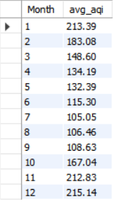

---

## Top 3 Most Polluted Months

### Query

```sql
SELECT
    Month,
    ROUND(AVG(AQI),2) AS avg_aqi
FROM air_quality
GROUP BY Month
ORDER BY avg_aqi DESC
LIMIT 3;
```

### Output

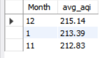

### Insight

Winter months consistently recorded the highest AQI levels.

---

# 4. AQI Category Analysis

## AQI Bucket Distribution

### Query

```sql
SELECT
    AQI_Bucket,
    COUNT(*) AS total_days
FROM air_quality
GROUP BY AQI_Bucket
ORDER BY total_days DESC;
```

### Output

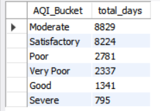

---

## AQI Bucket Percentage Distribution

### Query

```sql
SELECT
    AQI_Bucket,
    ROUND(
        COUNT(*) * 100.0 /
        (SELECT COUNT(*) FROM air_quality),
        2
    ) AS percentage
FROM air_quality
GROUP BY AQI_Bucket
ORDER BY percentage DESC;
```

### Output

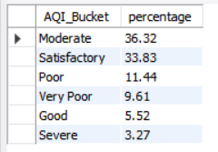

### Insight

Moderate AQI conditions accounted for the largest share of observations.

---

# 5. Pollutant Analysis

## Average Pollutant Concentration

### Query

```sql
SELECT
    ROUND(AVG(PM25),2) AS avg_pm25,
    ROUND(AVG(PM10),2) AS avg_pm10,
    ROUND(AVG(NO2),2) AS avg_no2,
    ROUND(AVG(SO2),2) AS avg_so2,
    ROUND(AVG(CO),2) AS avg_co
FROM air_quality;
```

### Output

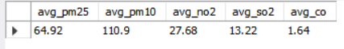

### Insight

PM10 and PM2.5 exhibited the highest average concentrations.

---

# 6. Advanced SQL Analysis

## Rolling 7-Day AQI Trend

### Query

```sql
SELECT
    Date,
    AQI,
    ROUND(
        AVG(AQI) OVER(
            ORDER BY Date
            ROWS BETWEEN 6 PRECEDING
            AND CURRENT ROW
        ),
        2
    ) AS rolling_7_day_avg
FROM air_quality;
```

### Output

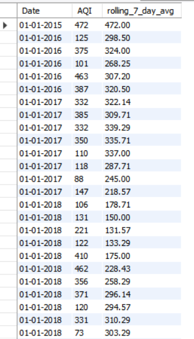

---

## AQI Change Detection Using LAG()

### Query

```sql
SELECT
    Date,
    AQI,
    LAG(AQI) OVER(
        ORDER BY Date
    ) AS previous_aqi,
    AQI -
    LAG(AQI) OVER(
        ORDER BY Date
    ) AS change_in_aqi
FROM air_quality;
```


### Output

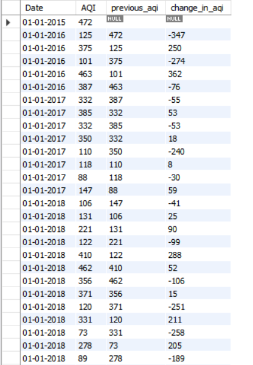

---

## Cities Above National Average AQI

### Query

```sql
WITH city_avg AS
(
    SELECT
        City,
        AVG(AQI) AS avg_aqi
    FROM air_quality
    GROUP BY City
)

SELECT *
FROM city_avg
WHERE avg_aqi >
(
    SELECT AVG(AQI)
    FROM air_quality
);
```

### Output

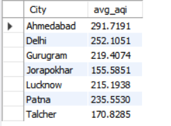

---

## Yearly Pollution Hotspot Ranking

### Query

```sql
SELECT
    City,
    Year,
    ROUND(
        AVG(AQI),
        2
    ) AS avg_aqi,
    DENSE_RANK() OVER
    (
        PARTITION BY Year
        ORDER BY AVG(AQI) DESC
    ) AS yearly_rank
FROM air_quality
GROUP BY City, Year;
```

### Output

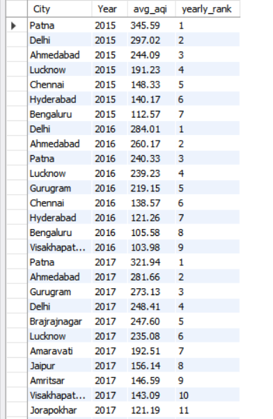

---

## Most Improved Cities

### Query

```sql
WITH city_year AS
(
    SELECT
        City,
        Year,
        AVG(AQI) AS avg_aqi
    FROM air_quality
    GROUP BY City, Year
)

SELECT
    City,
    Year,
    avg_aqi,
    LAG(avg_aqi) OVER(
        PARTITION BY City
        ORDER BY Year
    ) AS previous_year_aqi
FROM city_year;
```


### Output

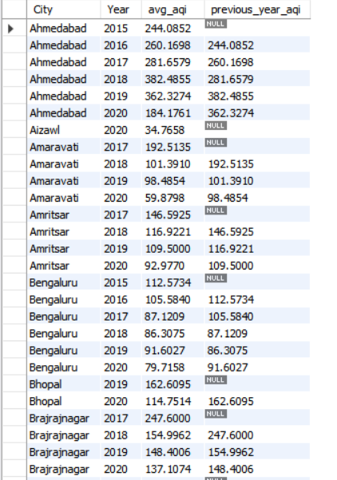

---

## Most Deteriorated Cities

### Query

```sql
WITH city_year AS
(
    SELECT
        City,
        Year,
        AVG(AQI) AS avg_aqi
    FROM air_quality
    GROUP BY City, Year
)

SELECT
    City,
    Year,
    avg_aqi -
    LAG(avg_aqi) OVER(
        PARTITION BY City
        ORDER BY Year
    ) AS yearly_change
FROM city_year;
```

### Output

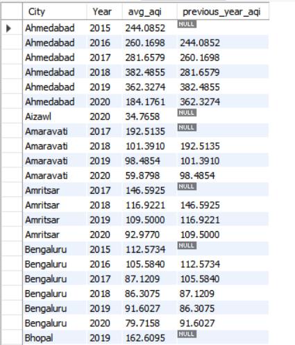

---

## Seasonal Pollution Pattern Analysis

### Query

```sql
SELECT
    CASE
        WHEN Month IN (12,1,2) THEN 'Winter'
        WHEN Month IN (3,4,5) THEN 'Summer'
        WHEN Month IN (6,7,8,9) THEN 'Monsoon'
        ELSE 'Post-Monsoon'
    END AS season,
    ROUND(AVG(AQI),2) AS avg_aqi
FROM air_quality
GROUP BY season
ORDER BY avg_aqi DESC;
```

### Output

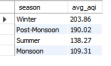

### Insight

Winter emerged as the most polluted season, while Monsoon recorded the cleanest air quality.

---

# Key SQL Findings

* Ahmedabad ranked among the most polluted cities.
* Aizawl consistently recorded the cleanest air quality.
* Average AQI declined significantly between 2015 and 2020.
* Winter emerged as the most polluted season.
* PM2.5 and PM10 were the dominant pollutant contributors.
* Several cities remained above the national average AQI.
* Window functions enabled advanced trend and ranking analysis.
